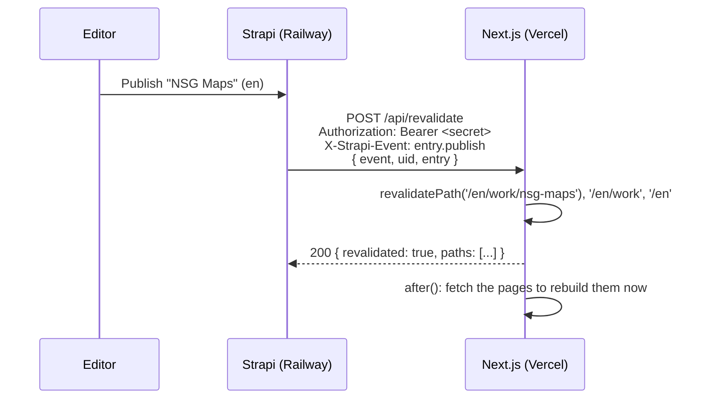

# On-demand revalidation: Strapi → Next.js

Publishing in Strapi should rebuild the affected Next.js pages immediately
instead of waiting for time-based ISR. Strapi does this with a webhook that
POSTs to an endpoint your Next.js app exposes. This document covers:

1. the endpoint your Next.js app must expose,
2. exactly what Strapi sends to it,
3. how the webhook is configured (in code, from env, not clicked together),
4. how to test it.

A drop-in handler lives at
[`docs/next/app/api/revalidate/route.ts`](next/app/api/revalidate/route.ts).



## 1. The endpoint Next.js exposes

| | |
|---|---|
| URL | `POST https://<your-site>/api/revalidate` |
| Auth | `Authorization: Bearer <REVALIDATE_SECRET>` header, compared timing-safe |
| Body | JSON, see section 2 |
| Must respond | any 2xx within 10 seconds. Strapi does not retry; a failure is only logged. |

Do the heavy work (warm-up fetches) after the response with `after()` from
`next/server` so the 10 second limit is never at risk.

Environment on Vercel:

| Variable | Purpose |
|---|---|
| `REVALIDATE_SECRET` | Must equal Strapi's `REVALIDATE_WEBHOOK_SECRET`. |
| `NEXT_PUBLIC_SITE_URL` | Optional. When set, the handler fetches the revalidated pages right away so they are rebuilt before the next visitor. |

Point the webhook at your **production** domain. Vercel preview deployments
are behind Deployment Protection by default, which rejects Strapi's POST.

## 2. What Strapi sends

Every request carries these headers:

```
Content-Type: application/json
Authorization: Bearer <REVALIDATE_WEBHOOK_SECRET>
X-Strapi-Event: entry.publish        # same value as body.event
User-Agent: node
```

Body shape for content events:

```json
{
  "event": "entry.publish",
  "createdAt": "2026-09-08T11:46:55.386Z",
  "model": "case-study",
  "uid": "api::case-study.case-study",
  "entry": { "...": "the entry, one locale, see below" }
}
```

`entry.locale` tells you which language was published. `entry.slug` is the
same in both locales. Media, components, and relations are populated on
`entry.publish`, `entry.create`, and `entry.update`; they are not populated on
`entry.unpublish` and `entry.delete`, which carry scalar fields only.

### Events the webhook subscribes to

| Event | Fires when | Handler action |
|---|---|---|
| `entry.publish` | a case study or experience is published, once per locale | revalidate that locale's affected pages |
| `entry.unpublish` | one is unpublished | same, so the page 404s or disappears from lists |
| `entry.delete` | one is deleted | same |
| `entry.update` | any save. For `global` and `home` (no draft & publish) this **is** the publish signal, `publishedAt` is set. For case studies and experiences a draft save also fires this with `publishedAt: null` | act only when `entry.publishedAt` is not null |
| `media.update`, `media.delete` | a file is replaced, its alt text edited, or it is deleted | revalidate every locale tree, the file can be on any page |
| `trigger-test` | you press **Trigger** in the admin's webhook settings | respond 200, revalidate nothing |

Publishing via a Release, bulk publish, or the API fires one event per entry
per locale, exactly like the button.

### Real captured payloads

Recorded from this Strapi instance on 2026-09-08. Long text is trimmed.

**`entry.publish`, case study, English:**

```json
{
  "event": "entry.publish",
  "createdAt": "2026-09-08T11:46:55.386Z",
  "model": "case-study",
  "uid": "api::case-study.case-study",
  "entry": {
    "id": 14,
    "documentId": "sp6z47lcij1elendrozynfu7",
    "title": "NSG Maps",
    "slug": "nsg-maps",
    "summary": "Navigation and place-discovery app for the Saudi market. ...",
    "role": "UI/UX Designer",
    "year": "2025",
    "platform": "iOS & Android",
    "team": "NSG Geospatial Services",
    "context": [ { "type": "paragraph", "children": [ { "type": "text", "text": "..." } ] } ],
    "constraints": [ { "type": "list", "format": "unordered", "children": [ "..." ] } ],
    "outcome": [ "..." ],
    "retrospective": [ "..." ],
    "tags": ["Mobile app", "Design system", "Documentation", "App-store assets", "Maps"],
    "order": 2,
    "featured": true,
    "createdAt": "2026-09-08T10:51:54.838Z",
    "updatedAt": "2026-09-08T11:46:54.849Z",
    "publishedAt": "2026-09-08T11:46:55.376Z",
    "locale": "en",
    "decisions": [ { "id": 29, "heading": "...", "reasoning": "...", "rejectedAlternative": "..." } ],
    "coverImage": null,
    "gallery": []
  }
}
```

**`entry.update`, global single type, Arabic.** No draft & publish, so this is
the publish signal and `publishedAt` is set:

```json
{
  "event": "entry.update",
  "createdAt": "2026-09-08T11:46:55.900Z",
  "model": "global",
  "uid": "api::global.global",
  "entry": {
    "id": 1,
    "documentId": "aymsj75yfj4trl9dgk6n5oj3",
    "name": "محمد الغامدي",
    "roleLine": "مصمم واجهات وتجربة مستخدم — ...",
    "email": "mohd.alhaniah@gmail.com",
    "navWork": "الأعمال",
    "navAbout": "نبذة عني",
    "navContact": "تواصل",
    "publishedAt": "2026-09-08T11:46:55.893Z",
    "locale": "ar",
    "cvFile": null
  }
}
```

**`entry.update`, draft save on a case study.** Same shape as `entry.publish`
but `"publishedAt": null`. The handler ignores it.

**`entry.unpublish`, experience, English.** Scalars only:

```json
{
  "event": "entry.unpublish",
  "createdAt": "2026-09-08T11:46:56.413Z",
  "model": "experience",
  "uid": "api::experience.experience",
  "entry": {
    "id": 12,
    "documentId": "gwhm76fodq1opfb5puako8f2",
    "company": "Ejada Systems LTD",
    "jobTitle": "Web Developer",
    "location": "Jeddah",
    "startDate": "2023-02-01",
    "endDate": "2025-02-28",
    "isCurrent": false,
    "order": 2,
    "publishedAt": "2026-09-08T10:51:54.806Z",
    "locale": "en"
  }
}
```

**`media.update` / `media.delete`:**

```json
{ "event": "media.update", "createdAt": "...", "media": { "id": 3, "documentId": "...", "url": "https://res.cloudinary.com/..." } }
```

**`trigger-test`** (the admin's Trigger button):

```json
{ "event": "trigger-test", "createdAt": "2026-09-08T11:46:57.429Z" }
```

## 3. Strapi side: configured in code

Webhooks are database state, like permissions, so `src/index.ts` owns one
webhook named **`next-revalidate`** and reconciles it on every boot:

| Railway variable | Value |
|---|---|
| `REVALIDATE_WEBHOOK_URL` | `https://<your-site>/api/revalidate` |
| `REVALIDATE_WEBHOOK_SECRET` | any long random string, the same value as Vercel's `REVALIDATE_SECRET` |

Behaviour, all verified:

- Both set: creates the webhook, or updates it when the URL, secret, events,
  or enabled flag differ. Unchanged env logs nothing.
- Rotating the secret updates the stored `Authorization` header on next boot.
- URL set but secret missing: boot fails with a clear error.
- URL unset (local dev, or `npm run seed` run from a laptop against Railway):
  the webhook is left untouched. Nothing else in the admin is affected.

You will see it under **Settings → Webhooks** in the admin. Edits made there
are overwritten on the next boot; change the env instead.

## 4. Mapping payload → pages

The handler maps `uid` to the pages that render it, prefixed with
`entry.locale`. Adjust `ROUTES` in the handler to your route structure.

| `uid` | Pages revalidated (per locale) | Cache tags invalidated |
|---|---|---|
| `api::case-study.case-study` | `/{locale}`, `/{locale}/work`, `/{locale}/work/{slug}` | `strapi:case-study`, `strapi:case-study:{locale}`, `strapi:case-study:{locale}:{slug}` |
| `api::experience.experience` | `/{locale}/about` | `strapi:experience`, `strapi:experience:{locale}` |
| `api::home.home` | `/{locale}` | `strapi:home`, `strapi:home:{locale}` |
| `api::global.global` | `/{locale}` as a **layout** (every page under it, nav and contact live in the layout) | `strapi:global`, `strapi:global:{locale}` |
| `media.*` | every locale as a layout | `strapi:media` |

Paths and tags both work on their own. Paths need no changes to your fetch
code. Tags let you skip the route map entirely if you tag every Strapi fetch:

```ts
// lib/strapi.ts
export async function getCaseStudy(locale: 'ar' | 'en', slug: string) {
  const qs = new URLSearchParams({
    locale,
    'filters[slug][$eq]': slug,
    'populate[decisions]': 'true',
    'populate[coverImage]': 'true',
    'populate[gallery]': 'true',
  });
  const res = await fetch(`${process.env.STRAPI_URL}/api/case-studies?${qs}`, {
    headers: { Authorization: `Bearer ${process.env.STRAPI_API_TOKEN}` }, // optional: Public role can read
    next: {
      tags: ['strapi:case-study', `strapi:case-study:${locale}`, `strapi:case-study:${locale}:${slug}`],
      revalidate: 86400, // safety net if a webhook is ever missed
    },
  });
  if (!res.ok) throw new Error(`Strapi ${res.status}`);
  const json = await res.json();
  return json.data[0] ?? null;
}
```

Keep a long time-based `revalidate` as a fallback. Strapi does not retry
failed deliveries.

## 5. Testing

**Simulate Strapi against local Next.js** (no Strapi needed):

```bash
curl -s -X POST http://localhost:3000/api/revalidate \
  -H "Authorization: Bearer $REVALIDATE_SECRET" \
  -H "Content-Type: application/json" \
  -H "X-Strapi-Event: entry.publish" \
  -d '{"event":"entry.publish","createdAt":"2026-09-08T11:46:55.386Z","model":"case-study","uid":"api::case-study.case-study","entry":{"documentId":"sp6z47lcij1elendrozynfu7","slug":"nsg-maps","locale":"en","publishedAt":"2026-09-08T11:46:55.376Z"}}'
```

Expected response:

```json
{
  "revalidated": true,
  "event": "entry.publish",
  "uid": "api::case-study.case-study",
  "locale": "en",
  "paths": ["/en", "/en/work", "/en/work/nsg-maps"],
  "tags": ["strapi:case-study", "strapi:case-study:en", "strapi:case-study:en:nsg-maps"],
  "warmed": []
}
```

A draft save must be ignored:

```bash
curl -s -X POST http://localhost:3000/api/revalidate \
  -H "Authorization: Bearer $REVALIDATE_SECRET" -H "Content-Type: application/json" \
  -d '{"event":"entry.update","createdAt":"x","uid":"api::case-study.case-study","entry":{"documentId":"x","slug":"nsg-maps","locale":"en","publishedAt":null}}'
# -> {"ok":true,"ignored":"draft save"}
```

A wrong secret must be rejected:

```bash
curl -s -o /dev/null -w "%{http_code}\n" -X POST http://localhost:3000/api/revalidate \
  -H "Authorization: Bearer wrong" -H "Content-Type: application/json" -d '{"event":"trigger-test"}'
# -> 401
```

**End to end on Railway + Vercel:**

1. Set `REVALIDATE_WEBHOOK_URL` and `REVALIDATE_WEBHOOK_SECRET` on Railway, `REVALIDATE_SECRET` on Vercel, redeploy both.
2. In Strapi admin, Settings → Webhooks → `next-revalidate` → **Trigger**. Expect a 200.
3. Publish a case study. In Vercel → Logs, the `/api/revalidate` function shows the request with `paths` in the response body.
4. Load the page. It reflects the change without waiting for the ISR window.

## Gotchas

- Each locale is its own event. Publishing Arabic then English sends two requests, each revalidating only its locale. That is intended.
- On `entry.delete` the payload has the slug, so the detail page is revalidated and will 404 on the next render.
- `revalidateTag(tag)` with one argument is deprecated in Next.js 16. Use `revalidateTag(tag, 'max')` there.
- `after()` requires Next.js 15. On 14, `await` the warm-up instead and keep it small.
